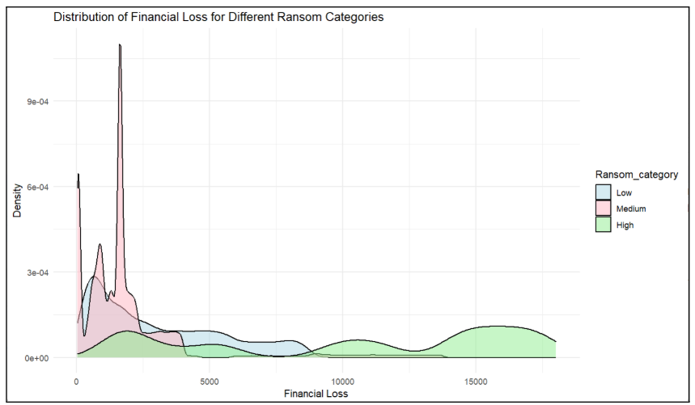
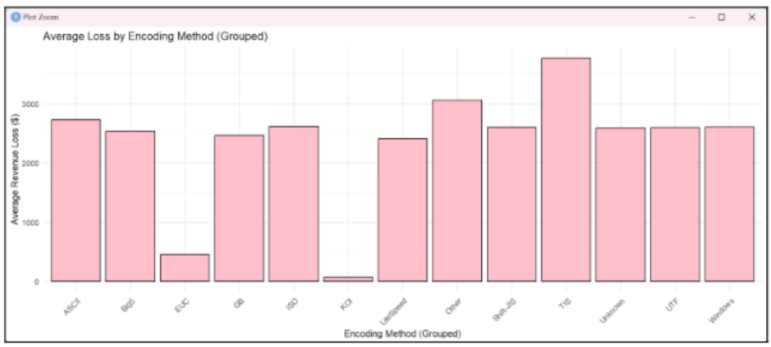
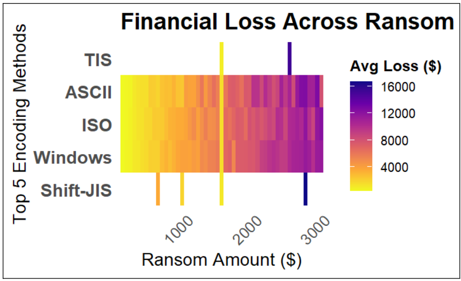

# 💻 Hacking Data Analysis with R

## 🎯 Objective
To analyze whether the **amount of ransom demanded** and the **type of encoding methods** used in cyberattacks influence the **financial loss** incurred by organizations.
Independent Variable: Encoding & Ransom
Dependent : Loss

## 🔍 Key Analysis Questions & Insights

### 1. 💰 How does the distribution of financial loss compare between ransom categories (Low, Medium, High)?
- A **strong positive relationship** is observed.
- As ransom category increases, the distribution of financial loss **shifts towards higher values**.
- However, **overlap exists** between categories, suggesting that ransom amount **is not the sole factor** influencing financial loss.
- Most low ransom demands result in relatively **low losses**, but **high ransom** demands show **unpredictable and sometimes extreme losses**.

---

### 2. 🧬 Is there an association between specific encoding methods and financial loss?
- Most encoding groups have **overlapping loss distributions**, indicating **similar impacts**.
- While encoding **influences financial loss**, it is **not a dominant predictor**.
  
---

### 3. 🔗 Do ransom amount and encoding method collectively influence financial loss?
- Certain encoding methods (e.g., **TIS**, **Windows**, **Shift-JIS**) are **more frequently associated with high losses**.
- The combination of **high ransom demands** and **specific encoding types** tends to lead to **greater financial loss**.
- Yet, **overlaps in distribution** suggest that other external factors also contribute.

---

## 📊 Overall Summary
- **Ransom amount and encoding method together** influence financial loss.
- Higher ransom generally correlates with **greater loss**, but not always.
- Some encoding methods are **linked to higher losses**, but **encoding alone isn't conclusive**.
- The data implies that **multiple factors** beyond ransom and encoding must be considered in predicting loss.

---

## 📁 Files Included
- `hacking_analysis.R` – Contains data wrangling, visualizations, and statistical modeling.
- `hackingdata.csv` – (Optional) Dataset used for analysis, if shareable.
- `README.md` – Summary of objectives, questions, and key findings.

---

## 🛠 Tools & Techniques
- **R Language** with `ggplot2` for data visualization
- Categorical data analysis
- Distribution comparison
- Data cleaning and transformation
- Exploratory data analysis

---

> ✨ *This analysis provides actionable insights for understanding the financial consequences of ransomware attacks in relation to technical attack vectors and demand levels.*
